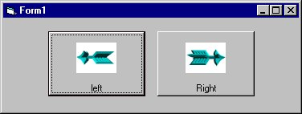



## Animate bitmap inside a button

### Description

Animate bitmap using the Microsoft Pictureclip control. In my example I animate inside a commandbutton  

tips: extract animated gifs in Animation workshop, make a bitmap of all the extracted images, load the image into the pictureclip control. and tada...  bye bye to the loose anim files. Please vote and send feedback. (questions are welcome too.)
 
### More Info
 

             |
---                |---
**Submitted On**   |2000-03-28 13:54:18
**By**             |[Atilla Duran](https://github.com/Planet-Source-Code/PSCIndex/blob/master/ByAuthor/atilla-duran.md)
**Level**          |Beginner
**User Rating**    |4.5 (50 globes from 11 users)
**Compatibility**  |VB 3\.0, VB 4\.0 \(16\-bit\), VB 4\.0 \(32\-bit\), VB 5\.0, VB 6\.0, VB Script, ASP \(Active Server Pages\) 
**Category**       |[Complete Applications](https://github.com/Planet-Source-Code/PSCIndex/blob/master/ByCategory/complete-applications__1-27.md)
**World**          |[Visual Basic](https://github.com/Planet-Source-Code/PSCIndex/blob/master/ByWorld/visual-basic.md)
**Archive File**   |[CODE\_UPLOAD71436252000\.zip](https://github.com/Planet-Source-Code/atilla-duran-animate-bitmap-inside-a-button__1-9250/archive/master.zip)

